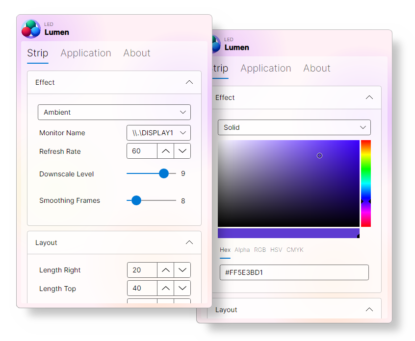
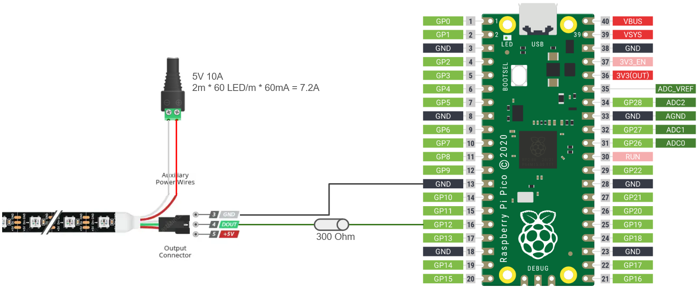

<p align="center">
  
</p>

<h1 align="center">Lumen</h1>

Lumen is an LED strip light controller and client package designed for desktop use. It supports various effects such as ambient or solid color lighting.

## Showcase

<p align="center">
  
</p>

## Supported Effects

| Feature            | Windows | Linux |
| ------------------ | ------- | ----- |
| Solid Color        | ✅      | ✅    |
| Adaptive Backlight | ✅      | 🔜    |

## Getting Started

This project is a mainly for personal use, so I haven't included extensive setup instructions. However, you're welcome to build the client and controller yourself. It's relatively straightforward, as the client is built in C# and the controller in Rust, both of which have user-friendly build systems.

If you need help, there are many guides available online. Feel free to open an issue if you run into any problems.

### Project Overview

The project consists of two components:

- **Client**: Runs on a desktop, handles various effects, and sends corresponding UDP messages to the controller.
- **Controller**: Runs on a microcontroller and controls the LED strip based on the messages received from the client.

### Building the Client

1. Open the solution file in an IDE like Visual Studio or Rider.
2. Click "Build" to compile the project.
3. After building, you can move the executable wherever you'd like.
4. To enable the app to start automatically at boot, adjust the settings in the application.

### Building and Deploying the Controller

Development was done using the [Pico Debug Probe](https://www.raspberrypi.com/products/debug-probe/), so the build process relies on this setup. It's possible to build without the probe, though I haven't tested it.

To get started:

1. Install [probe-rs](https://probe.rs/docs/getting-started/installation/).
2. Once everything is set up, run the following command to build and deploy:

   ```bash
   cargo run --release
   ```

#### Wi-Fi Configuration

Before deploying the controller, you'll need to configure your Wi-Fi credentials. Add your network name and password to the environment variables in `controller/.cargo/config.toml`.

### Hardware

- Raspberry Pi Pico W
- WS2812B LEDs (60/m or 100/m)
- A strong enough power supply (for 2m it should be around 5V 10A)

#### Wiring

<p align="center">
  
</p>
